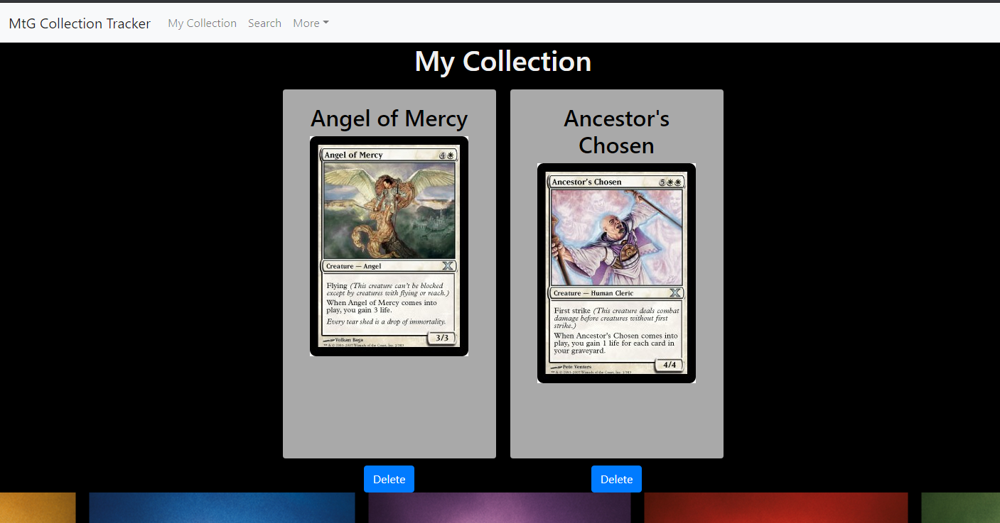

# magicCollectionTraker
MERN App that allows users to search for and save Magic the Gathering Cards to their Collection

## Table of Contents  
[About](#About)  
[Installation](#Installation)    
[Future-Development](#future-development)   
[Questions](#questions)   

## About Project  

This site was created for users who want to keep track of their Magic the Gathering Cards, physical or digital. The idea was spawned from wanting to theory craft decks while at work or away from my collection. So I've created a simple app where users can add cards to their collection tracker, and quickly view them while away from the physical cards or without opening up MtG Arena on their phone.

This app was created on the MERN stack, using MongoAtlas to host the database, and is deployed on Heroku. The frontend is primarily React with bootstrap and vanilla css.

## Installation  

For local installation:  
Clone the repository and run "npm install" in the terminal to install dependencies. This app uses mongoDB so be sure to start an instance of mongod and mongo for the database and create a "mycards" database. Run "npm start" in the terminal and go to localhost:3000 to view the site. Search for and add cards, go to your collection and view cards you saved, or delete cards from your collection.

## Deployment  
This app was deployed using Heroku and MongoAtlas for hosting the database. Follow the link below to visit the deployed site.

[deployed-link](https://mtg-collection-tracker.herokuapp.com/)  

## Preview

## Future-Development   

The main problem with the app currently is that there is no users/user authentication. Currently all users basically share a collection, adding and deleting cards to a global database. My next plan is to further develop the database to hold users and cards specific to those users. With that I will have to update the components that render the cards to pass through users. Along with this I want to add user authentication with Firebase.

Further down the line after implementing users I want to add the ability to sort your collection as collection with inevitably get bigger, and with that the ability to form and organize decks.

## Questions  
Please contact me via the links provided for any questions, concerns, compliments, or suggestions. :)

[My Github](https://github.com/apemint)